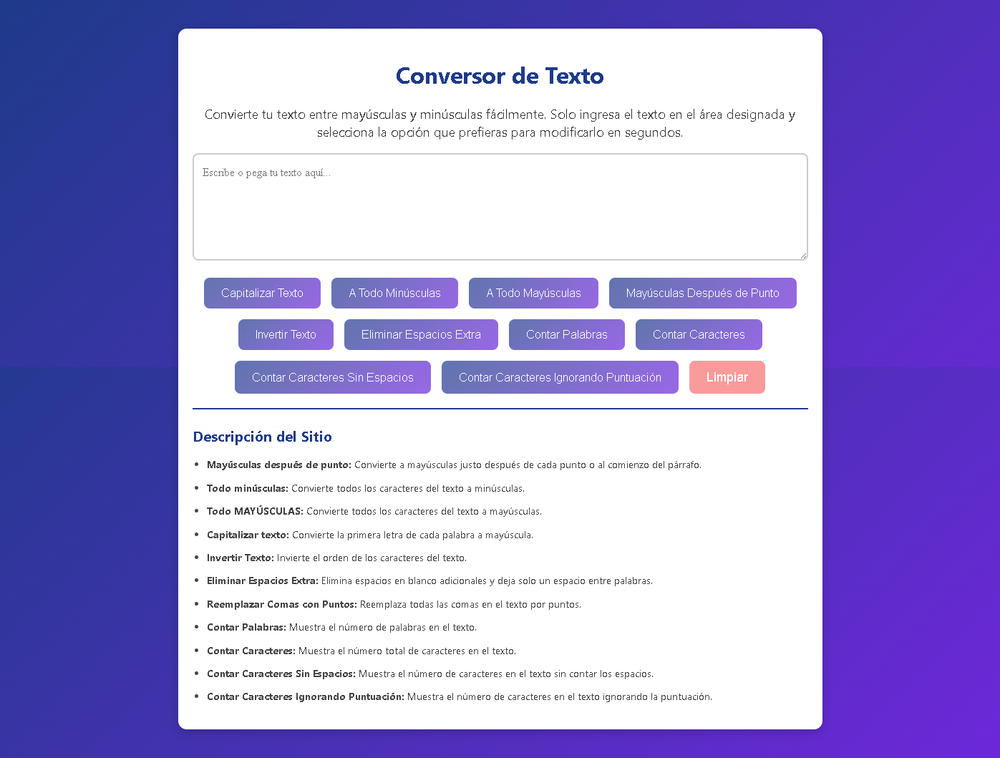

# 📝 Conversor de Texto

## 📖 Descripción
Este proyecto es una **aplicación de conversión de texto** interactiva que permite modificar y analizar texto de diversas maneras, como cambiar entre mayúsculas y minúsculas, contar palabras, caracteres y más. Ideal para usuarios que necesitan realizar tareas rápidas de manipulación de texto.

## 🌟 Características
- **Convertir a mayúsculas**: Convierte todo el texto a mayúsculas.
- **Convertir a minúsculas**: Convierte todo el texto a minúsculas.
- **Capitalizar**: Convierte la primera letra de cada palabra a mayúscula.
- **Invertir texto**: Invierte el orden de los caracteres en el texto.
- **Eliminar espacios extra**: Elimina espacios innecesarios entre palabras.
- **Contar palabras**: Cuenta el número total de palabras.
- **Contar caracteres**: Cuenta el número total de caracteres.
- **Contar caracteres sin espacios**: Cuenta caracteres excluyendo los espacios.
- **Contar caracteres sin puntuación**: Cuenta caracteres excluyendo signos de puntuación.

## 📸 Imágenes


## 🛠️ Tecnologías utilizadas
<p align="center">
  <a href="https://developer.mozilla.org/es/docs/Web/JavaScript" target="_blank">
    
  </a>
  <a href="https://developer.mozilla.org/es/docs/Web/CSS" target="_blank">
    
  </a>
  <a href="https://developer.mozilla.org/es/docs/HTML/HTML5" target="_blank">
    
  </a>
</p>

- **HTML5**: Para la estructura del documento.
- **CSS3**: Para los estilos y diseño responsivo.
- **JavaScript**: Para la funcionalidad interactiva y manipulación de texto.

## 🚀 Instalación y uso
### 1. Clona el repositorio a tu máquina local:
```bash
git clone https://github.com/xXRenzoElProXx/Mayusculas_Minusculas.git
```
### 2. Navega a la carpeta del proyecto:
```bash
cd mayusculas_minusculas
```
### 3. Abre el archivo index.html en tu navegador para visualizar la aplicación.

## 🧑‍💻 Uso de la aplicación
* **Convertir a mayúsculas:** Haz clic en el botón para convertir todo el texto en mayúsculas.
* **Convertir a minúsculas:** Haz clic en el botón para convertir todo el texto en minúsculas.
* **Capitalizar:** Convierte la primera letra de cada palabra a mayúscula.
* **Invertir texto:** Invierte el orden de los caracteres.
* **Eliminar espacios extra:** Elimina espacios innecesarios en el texto.
* **Contar palabras:** Muestra el número total de palabras.
* **Contar caracteres:** Muestra el número total de caracteres.
* **Contar caracteres sin espacios:** Excluye espacios al contar caracteres.
* **Contar caracteres sin puntuación:** Excluye signos de puntuación al contar caracteres.

## 📂 Estructura de archivos
```bash
mayusculas_minusculas/
├── index.html        # Archivo principal de la aplicación.
├── styles.css        # Hoja de estilos de la aplicación.
├── script.js         # Archivo JavaScript con la lógica de la aplicación.
├── screenshot.jpeg   # Captura de pantalla de la aplicación.
```
